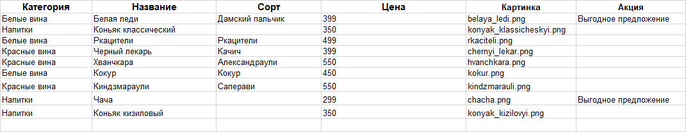
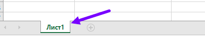

# Новое русское вино

Сайт магазина авторского вина "Новое русское вино".

## Подготовка файла с данными
Пример файла:  
`Изображение1`


`Изображение2`  
Данные в файле должны находиться в "Лист1"  
  

Названия столбцов должны строго соответсвовать данным на `Изображение1`  
Пример файла находится в главной директории проекта `wine.xlsx`

## Запуск

- Скачайте код
- Установите виртуальное окружение:
Для Windows
```
python -m venv venv
```
Для Linux  
```
python3 -m venv venv
```
- Перейдите в вируальное окружение:

```
venv/Scripts/activate
```   
Для Linux 
```
venv/bin/activate
``` 
- Установите бибилиотеки: 
```
pip install -r requirements.txt
```
- Запустите сайт командой: 
Для Windows
```
python main.py
``` 
для Linux 
```
python3 main.py
``` 
- Перейдите на сайт по адресу [http://127.0.0.1:8000](http://127.0.0.1:8000).

## Цели проекта

Код написан в учебных целях — это урок в курсе по Python и веб-разработке на сайте [Devman](https://dvmn.org).
